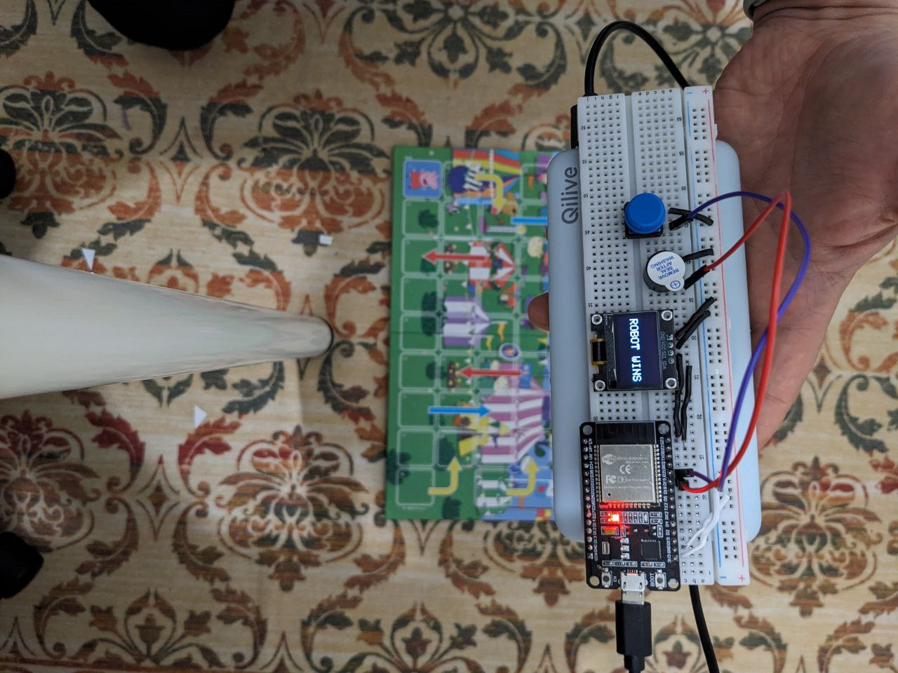

I made this project to play a board game with my son.
It includes one button, a display, a buzzer, and the main chip.
When you press the button, it rolls the dice and makes moves according to the game rules. Once it reaches the end, it displays “ROBOT WINS” and resets the move counter.
Here’s a photo of the build and the game:

